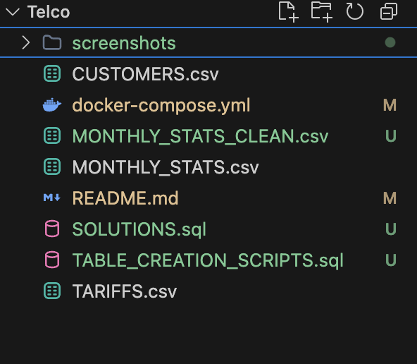
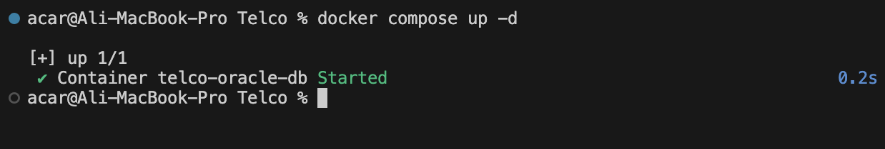
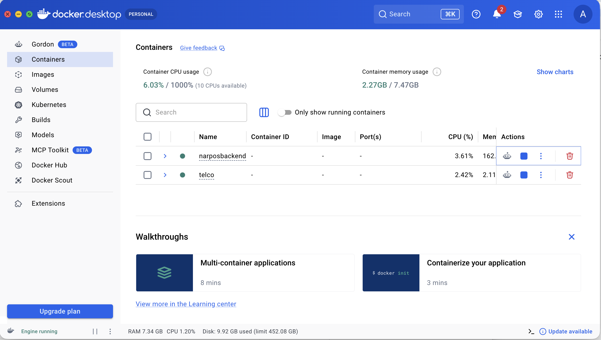
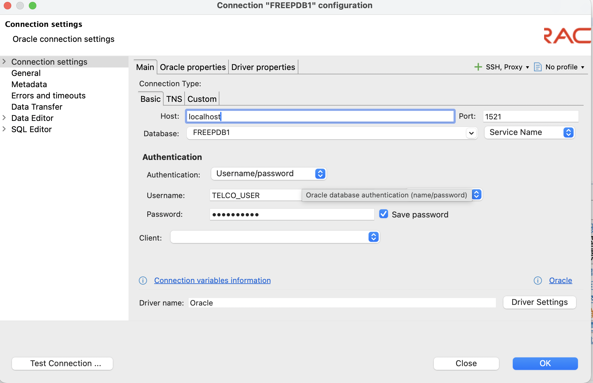
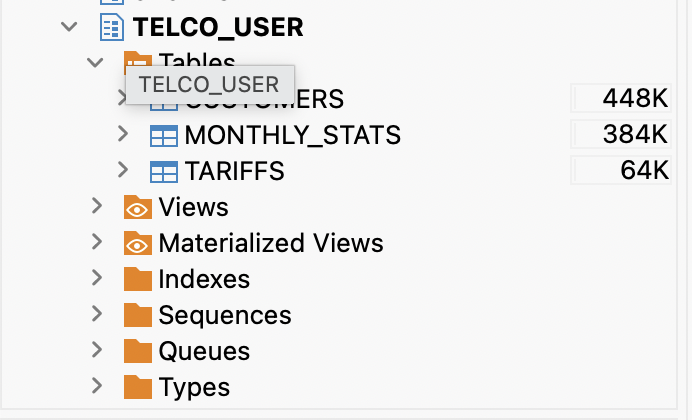
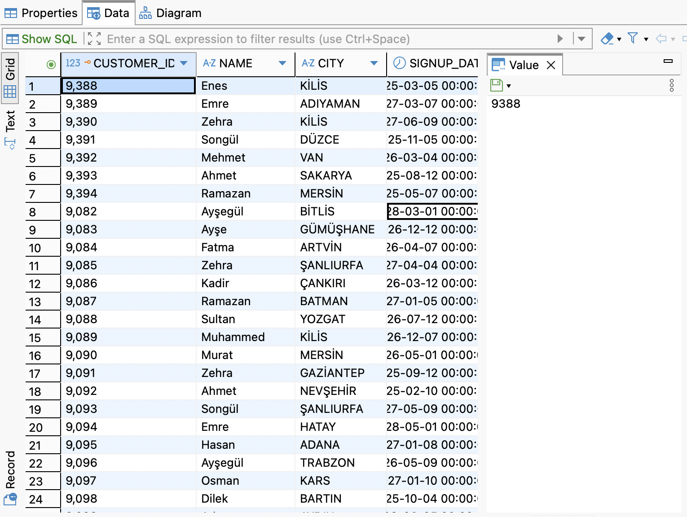

# Telco Data Analysis with Oracle XE

This project contains the database setup, data import process, and SQL solutions for the Telco data analysis task. The goal is to manage customer and tariff data effectively and provide statistical insights through SQL queries.

## Project Structure

The project is organized with the following files:

- `TABLE_CREATION_SCRIPTS.sql`: Scripts to create TARIFFS, CUSTOMERS, and MONTHLY_STATS tables with constraints and indexes.
- `SOLUTIONS.sql`: SQL queries for specific business requirements, including technical explanations and result outputs.
- `MONTHLY_STATS_CLEAN.csv`: Cleaned usage data (original file had formatting issues with decimal separators).
- `docker-compose.yml`: Docker configuration to run Oracle XE locally.



## Setup and Installation

The environment is containerized using Docker for easy reproduction.

### 1. Run Database
Move to the project directory and run the following command to start the Oracle XE container:
```bash
docker compose up -d
```


### 2. Verify Container Status
Ensure the `telco-oracle-db` container is running successfully in Docker Desktop or via terminal:


### 3. Connection Settings
Connect to the database using DBeaver with these settings:
- **Host:** localhost
   - **Port:** 1521
   - **Service Name:** FREEPDB1
   - **User:** TELCO_USER
   - **Password:** telco_pass



## Database Schema & Data

### Table Structure
The database initialization script creates three normalized tables. You can verify them in the Database Navigator:


### Data Verification
After the initial import, you can verify the data in the tables:


## Functional Requirements

The `SOLUTIONS.sql` file contains answers to the following categories:
1. **Tariff-Based Customer Queries**: Identifying customers on specific plans and finding the newest subscribers.
2. **Tariff Distribution**: Analyzing the popularity of different service plans.
3. **Customer Signup Analysis**: Identifying founding customers and their geographic distribution.
4. **Missing Monthly Records**: Detecting billing gaps and regional data anomalies.
5. **Usage Analysis**: Identifying high-usage customers (75% threshold) and those who exhausted their limits.
6. **Payment Analysis**: Tracking unpaid fees and payment behavior across tariffs.
